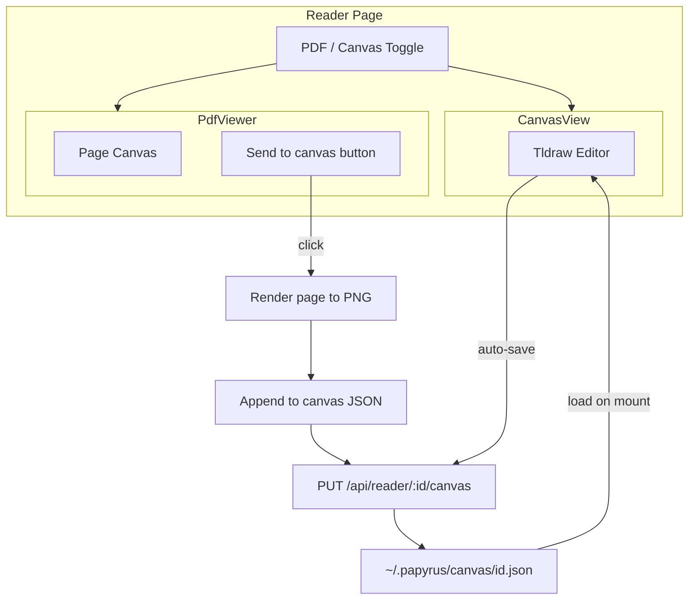

# TLDraw Canvas View — "Send to Canvas" Prototype

**Status:** Shelved for now. Plan saved for future implementation.

## Summary

Add a **Canvas view** as an alternative to the traditional PDF viewer. Each paper gets a blank TLDraw canvas (dark mode only). Instead of auto-tiling pages, a **"Send to canvas"** button on each PDF page lets users selectively send that page as an image to the canvas. Only the pages you're actively reasoning about (key figure, results table, architecture diagram) end up there — curation happens naturally.

**Prototype goal:** Get the "Send to canvas" button working on a single page first. Revisit tiling later if it still seems useful.

---

## Architecture

---

## Key Design Decisions

### 1. "Send to canvas" — user-driven curation

- Button on **each page** in the PDF viewer (per-page in `renderPageCanvas`)
- On click: render that page to PNG via pdfjs, add as image shape to canvas state, persist
- No auto-tiling; user chooses which pages matter

### 2. PDF page to image — client-side only

- Reuse `pdfjs-dist` in the client
- Render target page to offscreen canvas via `page.render()`
- `canvas.toDataURL('image/png')` → hand to TLDraw as image asset
- No native deps, no PyMuPDF

### 3. Canvas persistence — JSON on disk

- Store canvas state as JSON in `~/.papyrus/canvas/{paperId}.json` alongside notes
- New API: `GET /api/reader/:id/canvas` and `PUT /api/reader/:id/canvas`
- Use TLDraw's `getSnapshot` / `loadSnapshot` format for compatibility

### 4. Adding images when Canvas view is not mounted

When user clicks "Send to canvas" from PDF view, the Canvas component may not be mounted. Use **headless canvas updates**:

- Fetch current canvas JSON via `GET /api/reader/:id/canvas`
- Create a `TLStore` with `createTLStore()`, load snapshot
- Add asset + image shape via store APIs (no UI needed)
- `getSnapshot(store)` → `PUT /api/reader/:id/canvas`
- When user switches to Canvas view, it loads from the same JSON — image is already there

### 5. View access — PDF | Canvas toggle

- Toggle in Reader (e.g. above left panel)
- `viewMode === 'pdf'` → PdfViewer with per-page "Send to canvas" buttons
- `viewMode === 'canvas'` → CanvasView (TLDraw, dark mode)

---

## Implementation Plan

### Step 1: Add TLDraw dependency

- Add `tldraw` to client/package.json
- Import `tldraw/tldraw.css` where TLDraw is used

### Step 2: Canvas API (server)

In server/routes/reader.js:

- `GET /:id/canvas` — read `~/.papyrus/canvas/{id}.json`, return JSON (or `{}` if missing)
- `PUT /:id/canvas` — write request body to `~/.papyrus/canvas/{id}.json`

Use existing `CANVAS_DIR` from lib/utils/paths.mjs.

### Step 3: PDF page → PNG utility (client)

Add `client/src/utils/pdfPageToImage.js`:

- `async function renderPdfPageToPng(pdfDoc, pageNumber, scale = 2)`
- Uses pdfjs `getPage`, `getViewport`, `render` to offscreen canvas
- Returns `{ dataUrl, width, height }`

### Step 4: Headless "add image to canvas" (client)

Add `client/src/utils/canvasAddImage.js`:

- `async function addImageToCanvas(paperId, { dataUrl, width, height })`
- `GET /api/reader/:id/canvas` → current snapshot (or empty)
- `createTLStore()`, `loadSnapshot(store, snapshot)`
- Create asset + image shape, add via `store.put()`
- `getSnapshot(store)` → `PUT /api/reader/:id/canvas`

### Step 5: "Send to canvas" button in PdfViewer

In PdfViewer.jsx:

- Add "Send to canvas" button to each page in `renderPageCanvas` (e.g. overlay on bottom-right of page)
- On click: `renderPdfPageToPng(doc, pageNumber)` → `addImageToCanvas(paperId, result)`
- Show toast: "Page N sent to canvas" (via callback from Reader)
- **Prototype:** Start with button on a single page (e.g. current page in single-page mode, or first page) to validate the flow

### Step 6: CanvasView component

New file: `client/src/components/CanvasView.jsx`

- Accept `paperId` prop
- Load snapshot from `GET /api/reader/:id/canvas`
- Render `<Tldraw store={store} />` with `TLStoreWithStatus` for async load
- `onMount`: force dark mode via `editor.user.updateUserPreferences({ colorScheme: 'dark' })`
- Listen to store changes, throttle-save to `PUT /api/reader/:id/canvas`

### Step 7: Reader integration

In Reader.jsx:

- Add `viewMode: 'pdf' | 'canvas'` state
- Add PDF | Canvas toggle
- Conditionally render PdfViewer vs CanvasView
- Pass toast callback to PdfViewer for "Page sent to canvas" feedback

---

## Challenges and Mitigations

| Challenge | Mitigation |
|-----------|------------|
| **Adding to canvas when not mounted** | Headless store: createTLStore, loadSnapshot, put records, getSnapshot, save via API |
| **Asset format in snapshot** | Use TLDraw's AssetRecordType + ImageShape; `src` as data URL for prototype |
| **CanvasView loading existing + new images** | Load from API on mount; "Send to canvas" writes to same file, so next load has it |
| **TLDraw UI clutter** | Force dark mode; optionally trim tools via `components` later |

---

## File Changes Summary

| File | Change |
|------|--------|
| client/package.json | Add `tldraw` dependency |
| server/routes/reader.js | Add GET/PUT `/:id/canvas` |
| client/src/utils/pdfPageToImage.js | **New** — render single PDF page to PNG |
| client/src/utils/canvasAddImage.js | **New** — headless add image to canvas JSON |
| client/src/components/PdfViewer.jsx | Add "Send to canvas" button per page |
| client/src/components/CanvasView.jsx | **New** — TLDraw + load/save from API |
| client/src/pages/Reader.jsx | Add view toggle, conditional render |

---

## Out of Scope (for prototype)

- Auto-tiling pages
- "Up to references" detection
- Light mode for Canvas view

---

## Notes from initial implementation attempt

- TLDraw bundle is large (~1MB) — consider lazy-loading CanvasView and canvas utilities only when user switches to Canvas or clicks "Send to canvas"
- date-fns was causing Vite dep optimization errors; may need to be added explicitly or excluded
